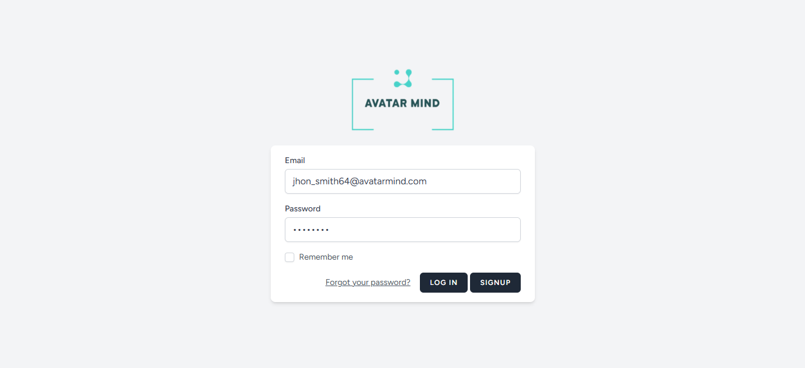
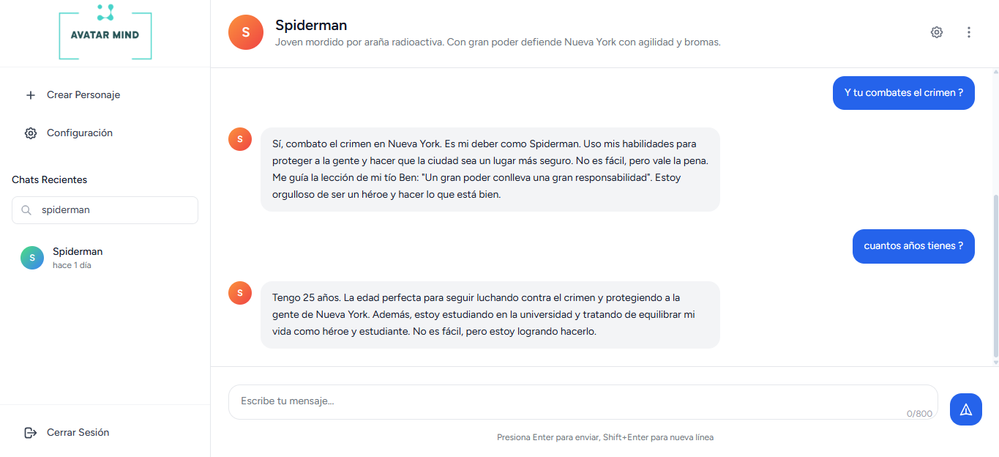
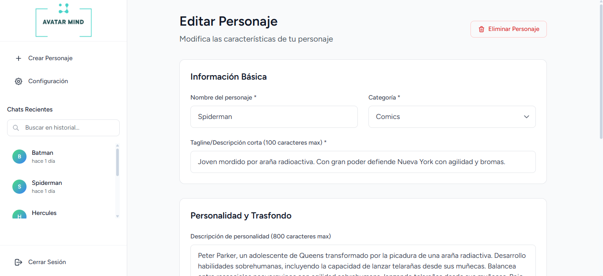
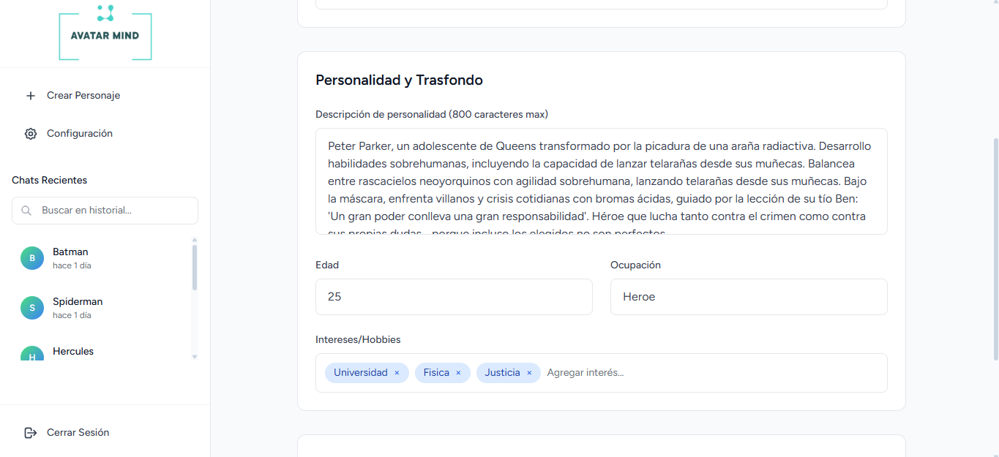
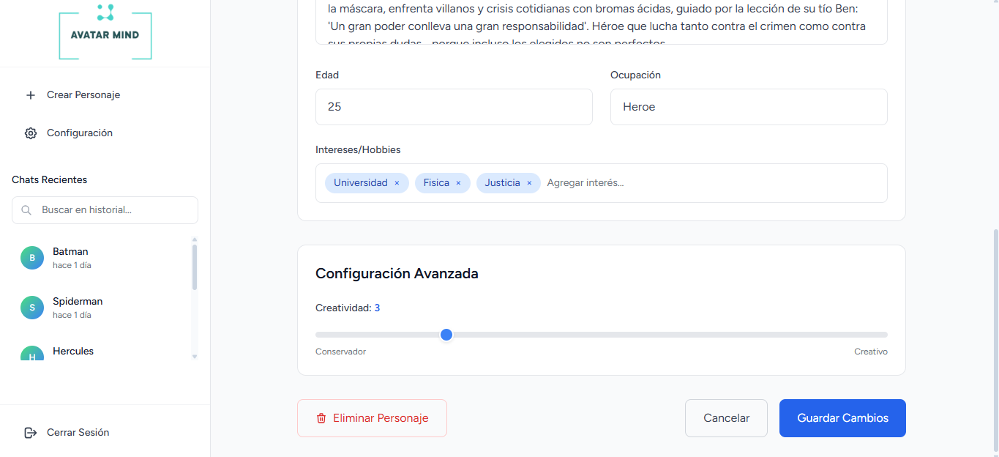
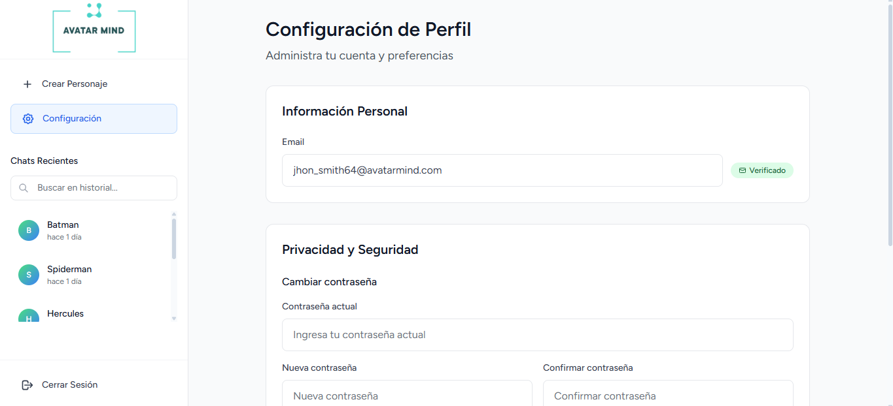
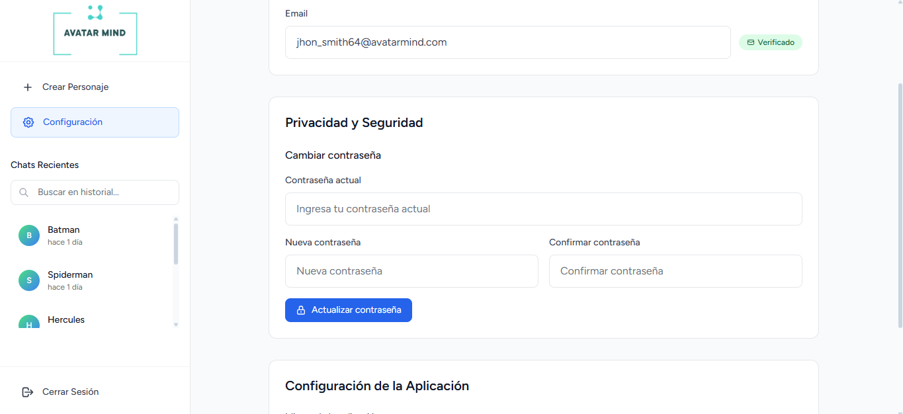
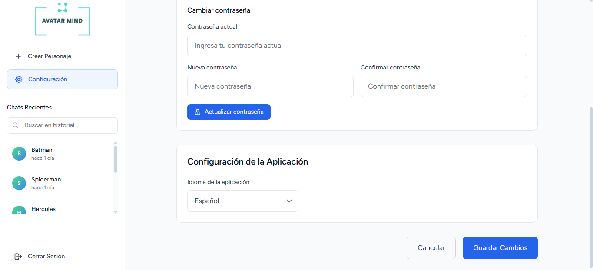

    

    
**Avatar Mind** es una aplicación inspirada en [character.ai](https://character.ai) que permite crear, personalizar e interactuar con personajes virtuales impulsados por **inteligencia artificial (LLMs)**.
Su objetivo es ofrecer una experiencia inmersiva donde los usuarios puedan diseñar personalidades únicas, conversar con ellas y explorar distintas narrativas.

Construido con **Laravel 11**, **Vue.js 3**, **MySQL**, **Tailwind CSS** y potenciado por **llama** (LLM), Avatar Mind combina un backend sólido, una interfaz moderna y capacidades avanzadas de IA conversacional.

&nbsp;&nbsp;

&nbsp;&nbsp;

 

### Capturas de pantalla

#### Login

*Figura 1: inicio de sesion.*

#### Chat

*Figura 2: chat con un personaje.*

#### Crear o Editar personaje

*Figura 3: Informacion basica del personaje.*

*Figura 4: Personalidad y transfondo del personaje.*

*Figura 5: Configuracion avanzada del personaje.*

#### Configuracion de perfil

*Figura 6: Configuracion de informacion personal.*

*Figura 7: Configuracion de privacidad y seguridad.*

*Figura 8: Configuracion de la aplicacion.*